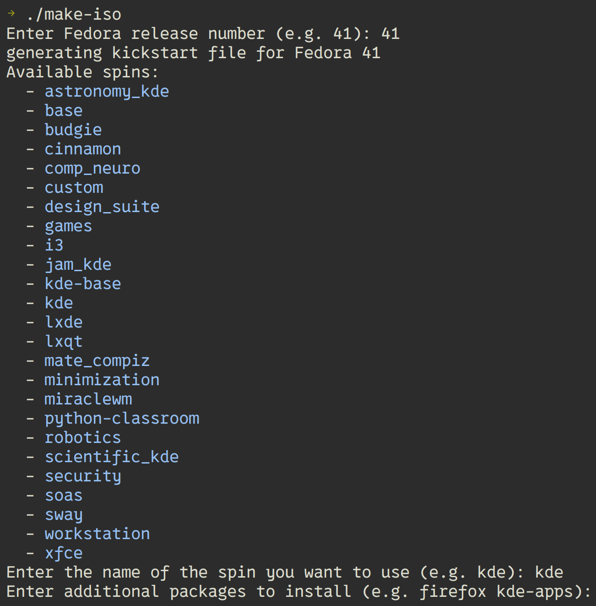

# custom livecd

A bash script to help you generate fedora livecd iso with custom package/desktop environment...

## Usage

> [!IMPORTANT]
> Besure `mock`, `ksflatten`, `livemedia-creator` are installed on your fedora

```
dnf install kernel-modules-$(uname -r) mock ksflatten
```

How to use: run script and answer question
```
./make-iso
```



## Trouble shooting

> [!TIP]
> As document said, selinux should be disable: `sudo setenforce 0`

> [!TIP]
> Only current release and two release forward are supported

## Reference

https://fedoraproject.org/wiki/Livemedia-creator-_How_to_create_and_use_a_Live_CD
